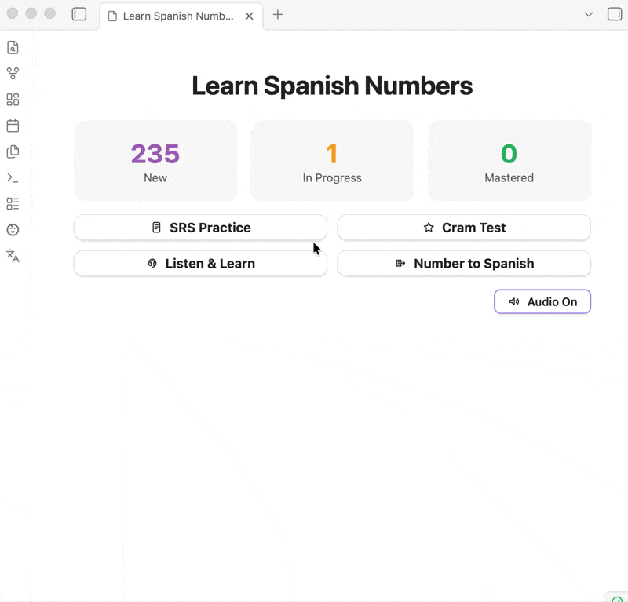

# Learn Spanish Numbers

An Obsidian plugin for practicing Spanish numbers with spaced repetition, cram sessions, audio, and listening drills.

## Features

### SRS Practice
Review numbers over time with spaced repetition.

### Cram Test
Drill a chosen range until you know it.

### Number to Spanish
Convert a number into Spanish text and hear it spoken.

### Listen & Learn
Practice by listening to spoken numbers in guided playback modes.

### Focused Range Presets
Start quickly with common number groups and tricky ranges.

### Audio
Hear Spanish number pronunciation with selectable voices.

### Progress and Reminders
Track learning progress and optionally receive practice reminders.

## Installation

This plugin is not in the official Obsidian community plugin list. Install it with BRAT:

1. In Obsidian, install and enable `BRAT` (`Beta Reviewers Auto-update Tester`).
2. Open `Settings -> BRAT`.
3. Choose `Add Beta plugin`.
4. Paste this repository URL:
   `https://github.com/TfTHacker/learn-spanish-numbers-obsidian`
5. Enable `Learn Spanish Numbers` in `Settings -> Community plugins`.

## How SRS Works

The plugin uses a simple SM-2 style progression:

| Action | Effect |
| --- | --- |
| `Again` | Short retry inside the current session |
| `Hard` | Marks correct, schedules a shorter next interval |
| `Good` | Marks correct, advances the normal interval |

## Notes

- The plugin stores settings, card state, and session history through the normal Obsidian plugin data file.
- Google Translate TTS is used only for audio generation of the text being spoken.

## Developer Notes

Development and local build notes are in [docs/development.md](docs/development.md).

## Author

- Twitter/X: [@TfTHacker](https://x.com/TfTHacker)
- Website: [tfthacker.com](https://tfthacker.com/)
